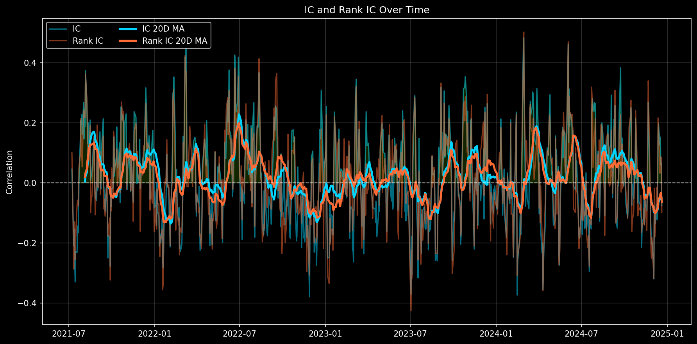
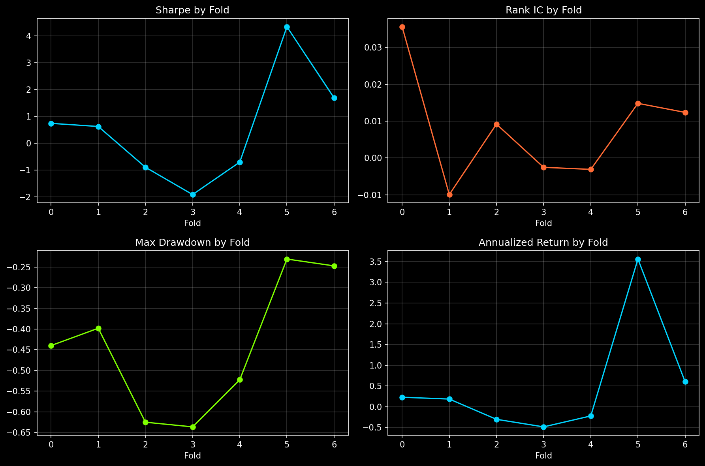
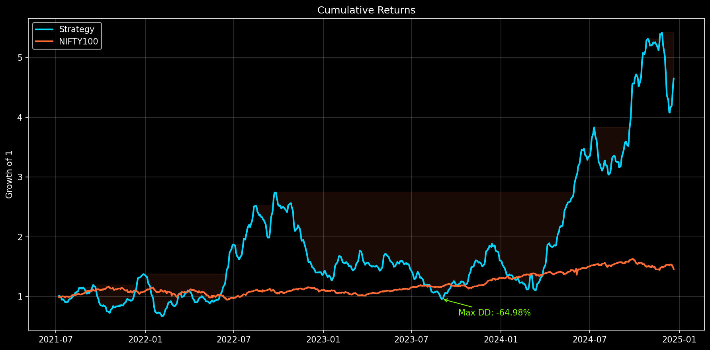
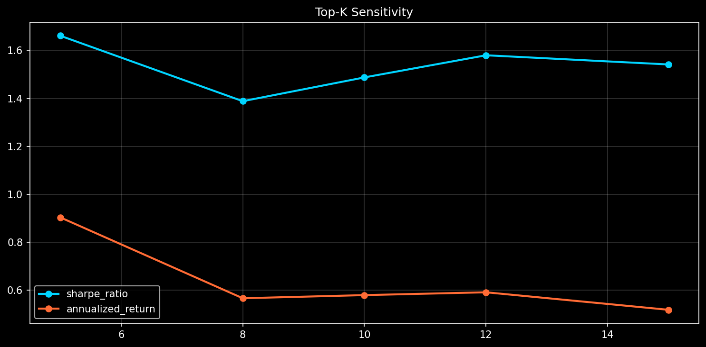
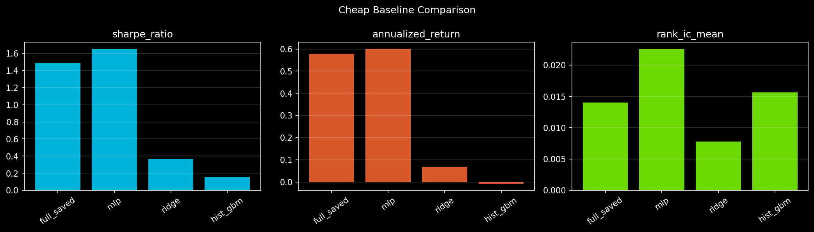
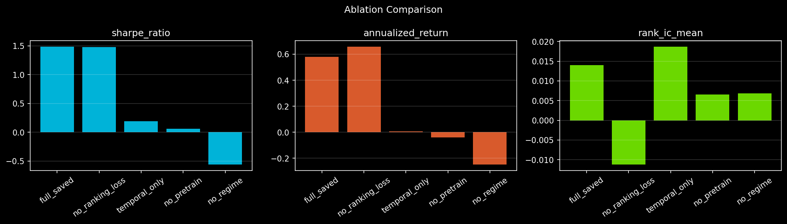
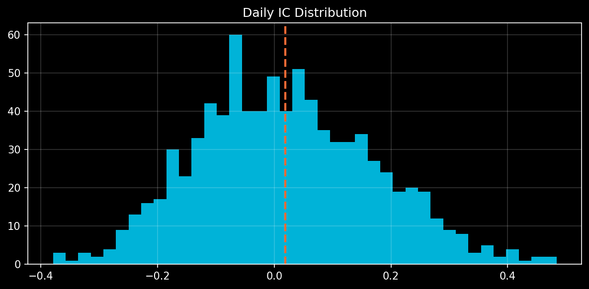

# NIFTY 100 Return Prediction System

End-to-end research pipeline for **cross-sectional stock return prediction** on the NIFTY 100 universe using:

- Multi-scale **PatchTST** temporal encoding
- Multi-relational **graph attention** over sector, rolling-correlation, and embedding-similarity relations
- Multi-task heads for **return regression**, **cross-sectional ranking**, and **direction**
- Self-supervised **masked patch pretraining**
- Walk-forward evaluation with **IC, Rank IC, spread, Sharpe, drawdown, turnover**, and plotting

## Objective

The system is built for **return prediction and stock ranking**, not raw price forecasting.

At each date:

1. Build a lookback window of engineered features for every stock in the universe.
2. Encode each stock with a multi-scale PatchTST backbone.
3. Refine stock embeddings with sector and dynamic graph relations.
4. Predict future residual return, rank score, and direction signal.
5. Construct a portfolio-aligned final score and evaluate it in a walk-forward setting.

## Key Design Choices

- Primary target: **5-day forward residual log return**
- Walk-forward evaluation only, no random split
- Cross-sectional daily normalization across the NIFTY 100 universe
- Validation-tuned final `alpha_score` blending of:
  - `pred_return`
  - `pred_rank`
  - direction confidence
- Recency-weighted supervised training inside each fold
- Overlap-safe aggregate evaluation using de-duplicated test windows

## Results Snapshot

Latest saved run (`results/metrics/aggregate_metrics.json`) on the walk-forward test periods:

| Metric | Value |
|---|---:|
| IC Mean | 0.0189 |
| Rank IC Mean | 0.0140 |
| Score Rank IC Mean | 0.0156 |
| Top-K Precision | 0.5094 |
| Annualized Return | 57.90% |
| Sharpe Ratio | 1.487 |
| Sortino Ratio | 2.617 |
| Max Drawdown | -64.98% |
| Annualized Turnover | 83.98 |

Best fixed-score robustness result from the same saved predictions:

| Execution Score | Top-K | Annualized Return | Sharpe | Max DD |
|---|---:|---:|---:|---:|
| `pred_rank` | 10 | 90.93% | 2.05 | -65.27% |

Cross-fold summary (`results/metrics/final_summary.csv`):

| Fold Outcome | Count |
|---|---:|
| Positive Sharpe folds | 4 / 7 |
| Positive score-rank-IC folds | 4 / 7 |
| Best fold Sharpe | 4.34 |
| Worst fold Sharpe | -1.91 |

Cheap baseline comparison (`results/metrics/baselines_summary.csv`):

| Model | IC | Rank IC | Ann. Return | Sharpe | Max DD |
|---|---:|---:|---:|---:|---:|
| Full saved model | 0.0189 | 0.0140 | 57.90% | 1.49 | -64.98% |
| MLP | 0.0290 | 0.0225 | 60.05% | 1.65 | -45.57% |
| Ridge | 0.0137 | 0.0078 | 6.78% | 0.36 | -63.66% |
| HistGradientBoosting | 0.0282 | 0.0156 | -0.74% | 0.15 | -67.32% |

Targeted ablations (`results/metrics/ablations_summary.csv`):

| Variant | IC | Rank IC | Ann. Return | Sharpe | Max DD |
|---|---:|---:|---:|---:|---:|
| Full model | 0.0189 | 0.0140 | 57.90% | 1.49 | -64.98% |
| No pretraining | -0.0026 | 0.0065 | -3.88% | 0.06 | -74.18% |
| No regime | 0.0085 | 0.0069 | -24.91% | -0.56 | -81.43% |
| Temporal only | 0.0190 | 0.0187 | 0.67% | 0.19 | -78.06% |
| No ranking loss | 0.0220 | -0.0113 | 65.88% | 1.48 | -63.06% |

## Selected Plots

### Walk-Forward Signal





### Portfolio Behavior





### Baselines and Ablations





### Significance



## Repository Layout

```text
nifty100_predictor/
├── config/
│   └── config.yaml
├── data/
│   ├── raw/
│   ├── processed/
│   └── universe.csv
├── docs/
│   └── research_upgrades.md
├── results/
│   ├── checkpoints/
│   ├── metrics/
│   └── plots/
├── scripts/
│   ├── 00_smoke_test.py
│   ├── 01_download_data.py
│   ├── 02_build_features.py
│   ├── 03_pretrain.py
│   ├── 04_train_walkforward.py
│   ├── 05_evaluate_and_plot.py
│   ├── 06_significance_report.py
│   └── 07_robustness_report.py
├── src/
└── requirements.txt
```

## Setup

```bash
python3 -m venv .venv
source .venv/bin/activate
pip install -r requirements.txt
```

## Standard Run Flow

```bash
python3 scripts/01_download_data.py
python3 scripts/02_build_features.py
python3 scripts/03_pretrain.py
python3 scripts/04_train_walkforward.py
python3 scripts/05_evaluate_and_plot.py
```

## Post-Run Research Analysis

Use existing saved predictions to generate statistical and robustness analysis without retraining.

```bash
python3 scripts/06_significance_report.py
python3 scripts/07_robustness_report.py
```

These scripts produce outputs such as:

- `results/metrics/significance_report.json`
- `results/metrics/significance_table.csv`
- `results/metrics/robustness_dashboard.json`
- `results/metrics/robustness_topk.csv`
- `results/plots/significance_ic_distribution.png`
- `results/plots/robustness_topk.png`

## Baselines and Ablations

The repository includes a lightweight publication-oriented experiment layer:

```bash
python3 scripts/08_run_baselines.py
python3 scripts/09_run_ablations.py
```

Implemented cheap baselines:

- Ridge regression
- Histogram Gradient Boosting (cheap tree boosting proxy)
- MLP regressor

Implemented ablations:

- `no_pretrain`
- `no_ranking_loss`
- `no_regime`
- `temporal_only` (PatchTST without graph module)

Generated summaries:

- `results/metrics/baselines_summary.csv`
- `results/metrics/ablations_summary.csv`
- `results/plots/baselines_comparison.png`
- `results/plots/ablations_comparison.png`

## Reproducibility Notes

- Main config lives in `config/config.yaml`.
- Runs log a config hash and timestamps to help reproduce experiments.
- If `wandb` is unavailable, logs fall back to CSV under `results/metrics/`.
- Training uses fixed seeds where applicable (`torch.manual_seed(42)`).

## Git / GitHub Notes

This repository is configured to **exclude most local experiment artifacts** from Git:

- downloaded market data
- processed feature parquet files
- model checkpoints
- most generated metrics
- most generated plots
- local virtual environment

Tracked files include:

- source code
- scripts
- config
- docs
- `data/universe.csv`
- selected summary metrics and selected final result plots referenced in this README

## Current Status

This repository is intended as a **research codebase** for NIFTY 100 cross-sectional forecasting.

The strongest current results come from:

- positive IC / Rank IC
- positive top-k precision above random baseline
- portfolio backtests with realistic turnover and transaction costs

The most important next steps for publication-quality evaluation are:

1. Baselines
2. Ablations
3. Significance reporting
4. Robustness analysis

## License / Data

Market data is downloaded from Yahoo Finance at run time and is **not** committed to the repository.
Please review the relevant data-source terms before redistribution.
